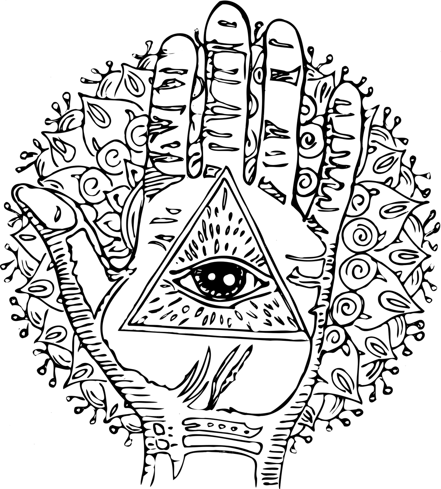
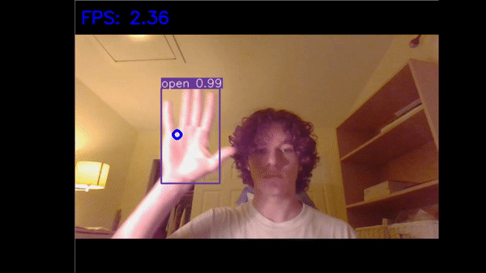
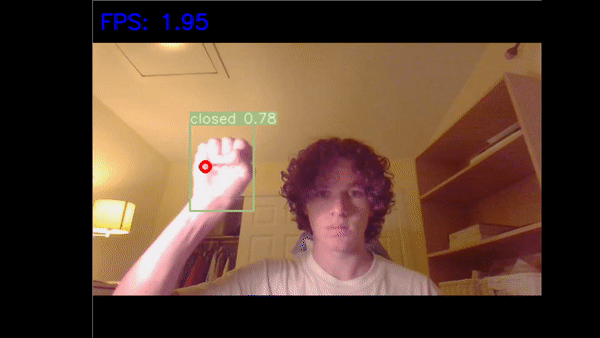
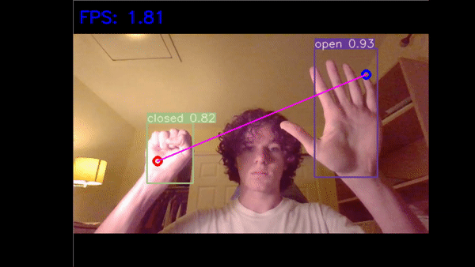
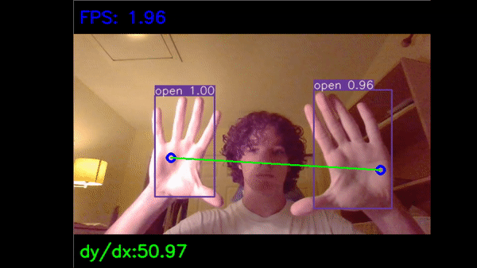

# Hamsa
This is a UI to interact with 3D models created in Autodesk's Fusion 360. The user has the ability to zoom in, pan, and rotate around the object. This project is called Hamsa to represent the connection between Hands (of the user), and the eye (computer vision).

## Notes
- I just want to apologize in advance for the frame rate that I am running in each GIF. I did the enirety of this project on a 2018 HP Envy Laptop (save training using Google's platform). I do not have a GPU, so I have to run inferences from a CPU.
- The UI mimics both keyboard and mouse input, and does not communicate with Fusion 360 directly
- I feel cool becuase this is how Tony Stark interacts with his suits in the movies

## Training the Model
I first started taking images. I took ~200 images of opened and closed hands through my webcam, ending up with 398 images total. Images were taken in a variety of locations, lighting patterns, etc. After this, I used a Yolov3 [labeling tool](https://github.com/Cartucho/OpenLabeling) to draw a bounding box around each opened and/or closed hand in the frame.

After this, I read the `README.MD` of the [C++ version of the Yolo models called darknet](https://github.com/AlexeyAB/darknet). I used this to create the necessary files for training and inference, based on my own labeled training images. Once all files were prepared, I downloaded the `darknet` folder as a zip to be stored in my Google Drive. I then opened this `.zip` file in a Google Colab (found in the training folder), and trained on my custom dataset. After training was completed, I saved the `.zip` file again so I could access the `yolov3-tiny0_best.weights` file, which contained the weights to run on my custom config for Yolov3, named `yolov3-tiny0-dark.cfg`

## Setting up the Weights in python
This part was simple: I cloned the [Yolov3](https://github.com/ultralytics/yolov3) repo which is essentially a Python wrapper for the original [C++ version called darknet](https://github.com/AlexeyAB/darknet). I then went into the `cfg/` portion of __yolov3/__ and added my custom config file that I used during training, as well as the `yolov3-tiny0_best.weights` file to the `weights/` directory. Once that was done, I could run the default commands found in the repository to get predictions off of my trained model.

## Actually adapting the model into a UI
This was done by editing the `detect.py` file inside of the __yolov3/__ directory, and saving it as a new file named `detect_box.py`. A seperate file named `hand_altering.py` holds multiple functions used inside of `detect_box.py`. To see what was actually edited between the files, see [here](https://www.diffchecker.com/lANKgUWu)

## Hand Gestures
### 1. Move the mouse

Moving your open hand inside of the frame will move the mouse. The blue circle indicates the center in which the mouse will actually be positioned. Of course, both the frame and window of the actual computer screen are different, so scaling is done to achieve an accurate position.
### 2. Pan over the model

Moving your closed hand inside of the frame will pan over the model. The red circle indicates the center in which the mouse will actually be positioned. Of course, both the frame and window of the actual computer screen are different, so scaling is done to achieve an accurate position.
### 3. Rotate around the model

Moving your open hand, while having a closed hand inside of the frame, will rotate around the model. The initial position of the opened hand will serve as the anchor for rotation. Any move up, down, left, or right relative to the anchor will be used rotate in Fusion 360. The closed hand serves soley as an indicator that the user wants to rotate.
### 4. Zoom in or out

Moving two open hands towards or away from eachother will zoom out and in, respectively. The line formed between each hand represents the distance between each hand. The __derivative__ in respect to the length of the line is also displayed as __dy/dx__. A positive slope indicates a growth in the length of the line, so Hamsa zoom according to the value of __dy/dx__ at that point in time. A larger positive __dy/dx__ will zoom in more clicks relative to a smaller positive __dy/dx__. If the derivitave is negative, the same will happen but Hamsa will zoom out instead.

## Demo
I will make a demo of this tool in action to prove that it works, when I can get access to a computer with a GPU. My laptop cannot handle running Fusion 360, OBS, and Hamsa at the same time. It runs between 1-2 FPS.
